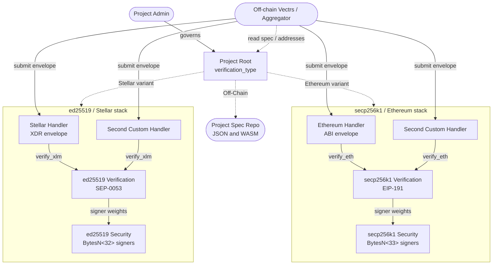

# WarpDrive Contracts

Soroban smart contracts for [WarpDrive](https://warp-drive.xyz), a platform for enterprise-grade, verifiable off-chain compute on the Stellar network. This repository is the deliverable for **Milestone 2: Soroban Security Contracts (PoA)** of [the WarpDrive proposal](https://ipfs.io/ipfs/bafybeifl56dmzfy6svrbb3in724bmrmh3bltah77t7b56vq3znhlb7w3ba).

## Overview

WarpDrive provides a trusted compute layer that turns arbitrary off-chain data and processes into provably correct on-chain actions. Off-chain execution nodes called **Vectrs** run user-defined circuits, produce signed attestations, and submit them to on-chain contracts for verification. These contracts form the on-chain trust layer that validates Vectr attestations before any state changes are committed to the Stellar ledger.

The contracts in this repository implement the core verification pipeline:

```
Handler --> Verification --> Security
```

- **Security** maintains a Proof-of-Authority registry of trusted Vectr public keys and their weights, and computes the threshold required for valid attestation.
- **Verification** validates signatures against the Security contract's signer set and threshold.
- **Handler** is the entry point for envelopes from a remote chain. It decodes the payload, enforces replay protection, and delegates cryptographic validation to the Verification contract.
- **Project Root** is the root governance contract for a WarpDrive project, controlled by the project's admin. It points to either the secp256k1 / Ethereum stack or the ed25519 / Stellar stack.

## Contracts and Packages

### Contracts

| Contract | Description |
|----------|-------------|
| [Ethereum Handler](./contracts/ethereum-handler/) | Entry point for envelopes originating from Ethereum-compatible chains; ABI-decodes payloads, enforces replay protection, and delegates to the secp256k1 verification contract |
| [Stellar Handler](./contracts/stellar-handler/) | Entry point for envelopes originating from Stellar; decodes payloads, enforces replay protection, and delegates to the ed25519 verification contract |
| [secp256k1 Security](./contracts/secp256k1-security/) | Proof-of-Authority registry of secp256k1 signers with weighted keys and configurable verification thresholds |
| [ed25519 Security](./contracts/ed25519-security/) | Proof-of-Authority registry of ed25519 signers with weighted keys and configurable verification thresholds |
| [secp256k1 Verification](./contracts/secp256k1-verification/) | EIP-191 secp256k1 signature verification against the secp256k1 Security contract's signer set |
| [ed25519 Verification](./contracts/ed25519-verification/) | ed25519 signature verification against the ed25519 Security contract's signer set |
| [Project Root](./contracts/project-root/) | Minimal root governance contract for a WarpDrive project - references contract and URL for off-chain project specification |

### Packages

| Package | Description |
|---------|-------------|
| [Shared](./packages/shared/) | Shared library providing contract interfaces, admin transfer logic, checkpoint storage, and test utilities |
| [Client](./packages/client/) | Type-safe async Rust clients (`std`, off-chain) for invoking the deployed WarpDrive contracts via [`wasi-soroban-rs`](https://crates.io/crates/wasi-soroban-rs); not a contract — does not compile to WASM |

> **Note:** The client (and any downstream code consuming it) must depend on the `wasi-soroban-rs` / `wasi-stellar-rpc-client` forks rather than upstream `soroban-rs` / `stellar-rpc-client`. The forks replace `reqwest` and other non-WASI-compatible transports so the client can be compiled to a `wasm32-wasip2` component and run inside a WASI runtime. Using the upstream crates will break component builds.


## Architecture

A WarpDrive project deploys one of two parallel stacks, identified by `verification_type` on the [Project Root](./contracts/project-root/):

- **`Ethereum`** — secp256k1 keys, EIP-191 signatures, ABI-encoded envelopes. Use when the same signed payloads need to be verifiable on both EVM chains and Stellar.
- **`Stellar`** — ed25519 keys, SEP-0053 signatures, XDR-encoded envelopes. Use for Soroban-native projects with no EVM compatibility requirement.

The two stacks are structurally identical; only the cryptographic scheme and envelope encoding differ. The same governance admin controls the Project Root, the Security registry, and the Verification + Handler contracts in either variant.



All cross-contract calls go through the trait clients defined in [`packages/shared/src/interfaces/`](./packages/shared/src/interfaces/), so the on-chain contracts never depend on each other's crates. Off-chain Rust callers use the typed async clients in [`packages/client/`](./packages/client/).

## Docker Deployment

We provide [docker images](./docker/middleware/README.md) that allows you to deploy and interact with these core contracts without installing anything on your system. For CI, testing and production deployments, this is the easiest and most repeatable route. Read the [docker docs](./docker/middleware/README.md) for more information, or just deploy to testnet like this:

```bash
# start a long-lived process to serve all interactions
docker run -d --rm --name wdm \
  --pull=always \
  -e RPC_URL=https://soroban-testnet.stellar.org \
  -e NETWORK_PASSPHRASE="Test SDF Network ; September 2015" \
  -v $PWD/out:/out \
  ghcr.io/warp-driver/warpdrive-stellar-middleware:0.2

# easy run commands to deploy and update the contracts
docker exec wdm /warpdrive/cli.sh deploy --output-path /out/deploy.json
```

## Dev Quick Start

Install [Rust](https://rustup.rs/) (1.94.0+) and [Task](https://taskfile.dev/), then install the `wasm32v1-none` target and the [Stellar CLI](https://developers.stellar.org/docs/tools/developer-tools/cli/install-cli) (required for `task optimize` and `task deploy`):

```bash
task setup          # rustup target add wasm32v1-none + cargo install stellar-cli --locked
```

On Ubuntu/Debian, `stellar-cli` needs a few system libraries first:

```bash
sudo apt install -y build-essential pkg-config libdbus-1-dev libudev-dev
```

For other platforms, see the [official install guide](https://developers.stellar.org/docs/tools/developer-tools/cli/install-cli).

Then:

```bash
task build          # Build all contracts to WASM
task test           # Run all unit tests (builds first)
task check          # Quick cargo check without WASM build
task fmt            # Format code
task clippy         # Lint (warnings are errors)
task lint           # fmt-check + clippy
task optimize       # Stellar contract optimization for deployment
```

Run a single contract's tests:

```bash
cargo test -p warpdrive-handler
cargo test -p warpdrive-security
cargo test -p warpdrive-verification
cargo test -p warpdrive-project-root
```

Run a single test:

```bash
cargo test -p warpdrive-handler test_verify_success
```

## Deployment

You can build and optimize all contracts and then deploy them to testnet, with one command:

```bash
task testnet:deploy
```

You can then run some manual tests like:

```bash
task testnet:setup-signers

# should pass first time (second time is error 501 - EventAlreadySeen)
task testnet:eth-test-happy
# Should fail with 303 (InsufficientWeight)
task testnet:eth-test-insufficient
# Should fail with 301 (InvalidSignature)
task testnet:eth-test-invalid-sig

# Should pass first time (second time is error 501 - EventAlreadySeen)
task testnet:xlm-test-happy
# Should fail with 303 (InsufficientWeight)
task testnet:xlm-test-insufficient
# Should fail with 505 (OtherInvocationError) - panic on invalid ed25519 signature
task testnet:xlm-test-invalid-sig
```

Note: In order for this to work, you must have previously configured stellar-cli: `task setup`

### IPFS Project Specification

After deploying contracts, you can publish the project specification to IPFS via [Pinata](https://app.pinata.cloud). This pins a `spec.json` containing contract IDs, WASM hashes, and deployment metadata - the file that Vectrs query on startup.

```bash
# Set your Pinata JWT (get one at https://app.pinata.cloud/developers/api-keys)
export PINATA_JWT=<your-jwt>

task ipfs:build-spec    # Assemble spec.json + copy WASMs from deploy state
task ipfs:pin           # Upload WASMs and spec.json to Pinata
task ipfs:status        # Show current CID
```

Verify the published spec:

```bash
CID=$(cat .testnet/spec.cid)
curl -s "https://gateway.pinata.cloud/ipfs/$CID" | jq .
```

## License

GPL-3.0-or-later
